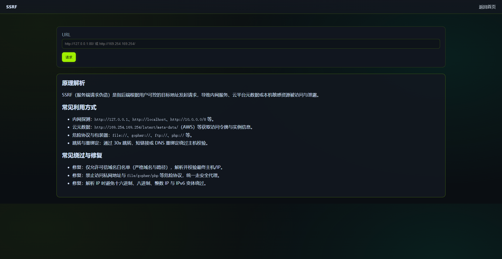

# PHP-Code-Sec Target Range (Offline | Supports one-click deployment with PHPStudy)

A local target range covering common PHP code auditing knowledge points. Organized similarly to DVWA/Pikachu, it includes an installation wizard and a completion tutorial.





## Feature Overview

- Installation Wizard: Generate Database and Configuration (MySQL / PDO)

- Authentication Module: Login / Registration / Logout (Demonstration of Weak Passwords and MD5 Storage)

- Vulnerability Modules (Partial):

- SQL Injection (Numerical / Character)

- XSS (Reflected / Stored / DOM)

- CSRF (Email Modification)

- File Upload Bypass (Double Extension, etc.)

- File Inclusion (LFI/RFI)

- Path Traversal

- Command Injection (Windows ping)

- SSRF (Internal Network Probing Example)

- Deserialization / PHAR Metadata Exploitation

- Open Redirect / Email Header Injection / Host Header Injection

- Weak Encryption (MD5 / rand)

- Logic Vulnerability (Price Parameter Tampering Example)

- Session Fixation (No Regenerate)

- RCE (eval code execution)

- Weak JWT validation (none algorithm / unverified signature)

- Unauthorized access via IDOR

- CORS misconfiguration (reflection Origin + allowed credentials)

- HPP parameter pollution (multi-value parameters)

- Arbitrary file writing (path traversal writing)

- Sensitive information leakage via phpinfo

- Clickjacking (unprotected)

Extended Modules (New):

- Variable overwriting (extract)

- XPath injection

- Regular expression ReDoS (catastrophic backtracking)

- PHP stream wrapper information leakage (php://filter)

- LDAP injection (filter concatenation)

- Web cache poisoning and deception (cache key/variable error)

- Secondary parsing (double decoding)

## Environment Requirements

- Windows + PHPStudy (recommended) or local PHP 7.4+/8.x + MySQL 5.7+/8.0+

- Browser only, no external network required

## One-Click Deployment (PHPStudy)

1. Copy this project folder to the PHPStudy `WWW` directory, for example: `C:\phpStudy\WWW\PHP-Code-Sec`

2. Start PHPStudy and ensure that `Apache/Nginx + PHP + MySQL` is running normally.

3. Access `http://localhost/PHP-Code-Sec/setup/install.php`

4. On the installation page, fill in the MySQL information (host, port, username, password). The database name can be the default `phpsec_lab`.

5. Click Install. After successful installation, `config/config.inc.php` will be automatically generated and the tables and sample data will be initialized.

6. Return to the homepage to start practicing: `http://localhost/PHP-Code-Sec/`

> Note: Common default usernames for PHPStudy may be `root` / empty password or `root` / `root`/`123456`. Please refer to your actual environment.

## Manual Run (Local PHP)

- Run in the project root directory:

``` php -S 127.0.0.1:3000 -t .

```

- Then access `http://127.0.0.1:3000/setup/install.php` to complete the installation; afterwards, access the homepage `http://127.0.0.1:3000/`

## Directory Structure

``` PHP-Code-Sec/

├─ index.php # Homepage and module navigation

├─ login.php / register.php / logout.php / profile.php

├─ setup/install.php # Installation wizard

├─ core/ # Initialization and database encapsulation

├─ config/ # Installation configuration

├─ modules/ # Vulnerable modules

├─ pages/ # Demo pages used in file inclusion

├─ data/ # Path traversal of demo files

├─ uploads/ # File upload directory

├─ assets/css/style.css # Cool dark style

└─ writeup.md # Walkthrough (detailed solution and payload)

└─ summary.md # Module source code index (quick path location)

```

## Important Notes

- This training exercise is for educational demonstration purposes. The code intentionally contains numerous security vulnerabilities. Do not deploy it in a production environment.

- It is recommended to use an isolated environment (such as a virtual machine/container/local test machine).

- After completing the training, please delete or isolate this project promptly to avoid misuse.

## Frequently Asked Questions

- Connection failure: Check if the MySQL port, username, password, and PDO extension are enabled.

- Page 500: Check if `setup/install.php` has successfully generated `config/config.inc.php`.

- RFI/PHAR demo: Some functions require enabling or utilizing specific PHP configurations. See `writeup.md` for details. ## License

This project is for security learning and auditing practice demonstration only. Unauthorized use for illegal purposes is prohibited.
